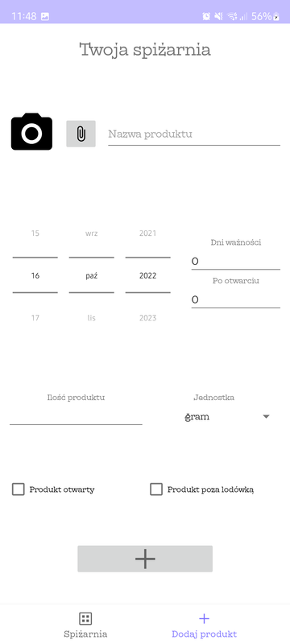
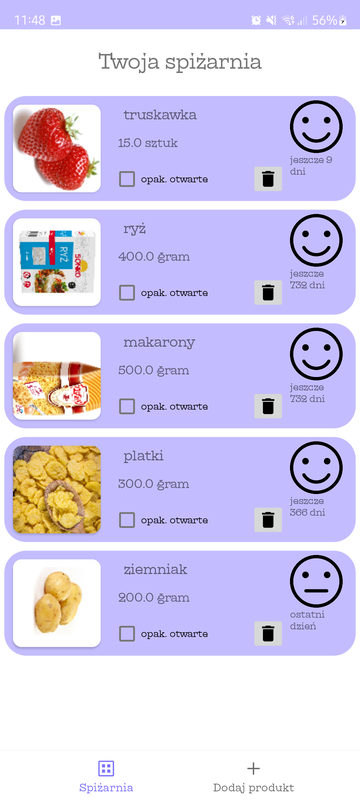
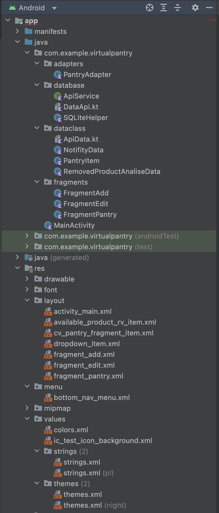

# Virtual Pantry - twoja wirtualna spiżarnia
Virtual Pantry jest aplikacją na urządzenia mobilne z systemem android, która pomaga w zarządzaniu żywnością znajdującą się w naszym domu z pomocą sztucznej inteligencji w celu zaoszczędzania czasu.

## Co oferuje nasza aplikacja?
Dzięki naszej aplikacji, możesz przyczynić się do pozytywnego wpływu na środowisko. Jakim sposobem? Kontrolując stan zdatności do spożycia produktów jesteśmy w stanie unikać sytuacji, w której wyrzucamy jedzenie do śmieci i marnujemy przez to żywność.

## Aktualne możliwości naszej aplikacji
Aktualnie nasza aplikacja pozwala na:
- dodawania artykułów do "spiżarni".
- rejestrowanie daty przydatności produktów za pomocą wygodnego systemy suwaków.
- wyświetlanie ile dni pozostało do zepsucia się produktu*.
- informowanie użytkownika o zbliżającym końcu sie terminu ważności produktu za pomoca powiadomień.
- wsparcie dla języka polskiego i angielskiego.

*Terminy ważności niektórych produktów sporzywczych nie mogą być dokładnie obliczane ze względu na brak "typowe" daty ważności. Przykładem są owoce i warzywa.

## Wymagania sprzętowe do użycia aplikacji
- Telefon z sytemem Android 10.0 Q
- Około 20MB wolnego miejsca do zainstalowania aplikacji (wraz z dodawaniem większej ilości produktów miejsce potrzebne rośnie)

## Wykorzystane technologie
- Aplikacja na telefon napisane w języku Kotlin z wykorzystaniem IDE Android Studio
- Serwer obsługujacy wysyłanie zdjeć w celu przetwarząnia AI napisany w pythonie
- AI stworzone z użyciem Tensorflow w Pythonie.

## Działanie naszej aplikacji
Działanie naszej aplikacji jest dokładnie opisane tutaj.
### Dodawanie produktów

### Pokazywanie produktów w naszym domu

### Powiadomienia o końcu terminów przydatności

## Użycie AI w projekcie
Cała aplikacja miała się opierać o prosty schemat:
1. Uruchamiamy aplikacje
2. Robimy zdjęcie produktu
3. AI zwraca nam z sewera, jaki to jest produkt
4. Uzupełniamy date ważności
5. Gotowe

Szkolenie aplikacji okazało sie bardzo trudne. Ilość produktów, ich stany dojrzałości w przypadku owoców i warzyw, tło, na którym zdjęcia byłyby wykonywane. Wszystkie te czynniki razem wzięte dały nam obraz dopiero podczas testów ile tak naprawde potrzeba danych i większe zasobu czasu w celu wyszkoleniea AI by bezproblemowo działało w warunkach "polowych". Nasze AI rozpoznaje produkty na których zostało przetrenowane, czyli zdjęcia głównie pobrane z internetu. W momencie zdjeć zrobionych przez nas sanych pojawiają się problemy z rozpoznawaniem obiektu. Całość projektu pomijając ten fakt jest w pełni funkcjonalna, a samo AI dla pełnego działa potrzebuje jedynie więcej danych oraz czasu na jego szkolenie by przemóc te różnorodność w postaci różnego koloru tła, oświetlenia itp.

## Rozpiska plików
1. Folder "virtual-pantry-app"
- pliki projektowe całej aplikacji android
2. Plik "130.h5"
- plik zawierający model sztucznej inteligencji
3. Plik "Ai train.py"
- plik służacy do trenowania sztucznej iteligencji
4. Plik "Server.py"
- plik servera obsługujacy żadania aplikacji i odpowiadania na zapytania związane ze przetwarzaniem zdjec przez AI
5. VirtualPantry.apk
- pakiet instalacyjny dla aplikacji na system android

## Hierarchia plików w projekcie aplikacji

### virtual-pantry-app/app/src/main/java/com/example/virtualpantry
1. Folder adapters
- zawiera adapter widoku dla RecyvleView
2. Folder database
- zawiera pliki dla bazy danych aplikacji
3. Folder dataclass
- zaweira pliki class stworzone na potrzeby aplikacji
4. Folder fragments
- zawiera strone ligiczną fragmentów (widoków)
5. MainActivity.kt
- główny wątek aplikacji

### /virtual-pantry-app/app/src/main/res
1. drawable
- obrazki wykorzystywane w projekcie
2. font
- czcionki użyte w projekcie
3. layout
- układy wykorzystywane przez okres trwania projektu
4. menu
- układ XML dla menu na dole aplikacji
5. values
- pliki colorów
- pliki języków
- pliki motywów

## Autorzy projektu
1. Miłosz Piekarski
2. Kacper Jaśniewicz
3. Jakub Grzelak